# BlogSakura——兼有图库与空间管理的综合博客平台

## 项目介绍

基于SpringBoot + Mybatis-Flex + Redis + RabbitMQ +
WebSocket的综合博客平台，除了提供发表、查看文章等基本博客功能以外，还提供公共图库、私有空间和团队空间模块。管理员能同时管理公共图库、用户和空间等模块，用户不仅能进行图片上传私有空间，还可以搭建团队空间并邀请其他用户共享和实时协同编辑图片。

## 项目架构图

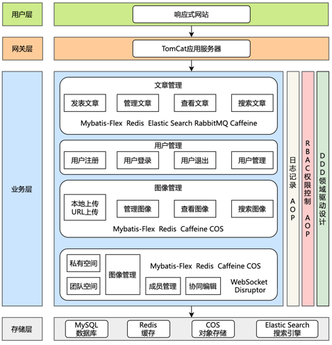

## 技术选型

### 后端

- Spring Boot3.6：搭建后端系统。
- MyBatis-Flex：MyBatis的增强版本，方便快速实现数据库的基本操作。
- RabbitMQ：消息队列，实现异步解耦、削峰等作用。
- Elastic Search: 一种开源的分布式搜索引擎，可以实现内容搜索。
- MySQL：数据库持久化。
- Redis：用作缓存，存储阅读数、热门文章等高频数据。
- Caffeine：本地缓存优化。
- 腾讯云COS：对象存储。
- WebSocket: 一种基于TCP协议的全双工通信协议，实现实时协同编辑图片。
- Disruptor: 高性能无锁环形队列。

### 前端

- React 19和TypeScipt: 搭建前端系统。
- Ant Design: 组件库。
- Axios：请求库。
- react-image-crop: 图像编辑库。
- react-masonry-css: 实现瀑布流的开源库。
- OpenAPI: 前端代码生成。

## 项目总结列表

此处部分比较多，故而用飞书链接形式展示：

[项目总结](https://rslvikpbsl.feishu.cn/docx/Iy5ld4CcAo4yUnxpBlgcs1lCnGf)

## 项目功能模块

### 前台

1. 首页
   
   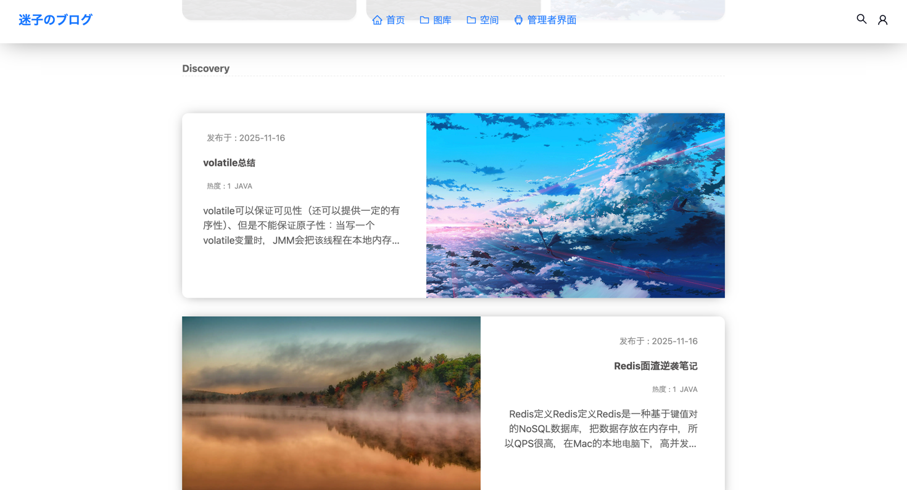
   参考[sakura博客](https://2heng.xin/)的风格，使用React和Ant Design、Shadcn/ui等实现。
2. 文章页
   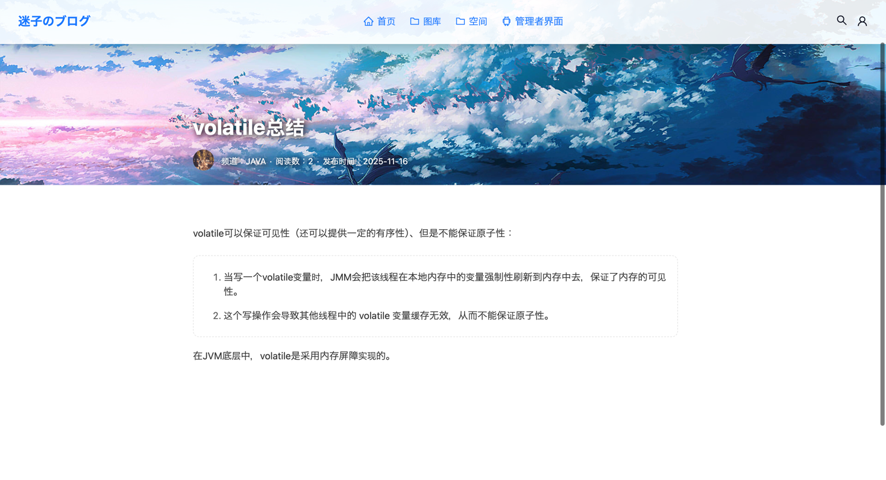
   参考[sakura博客](https://2heng.xin/)的风格，使用React和Ant Design、Shadcn/ui等实现。
3. 图库页
   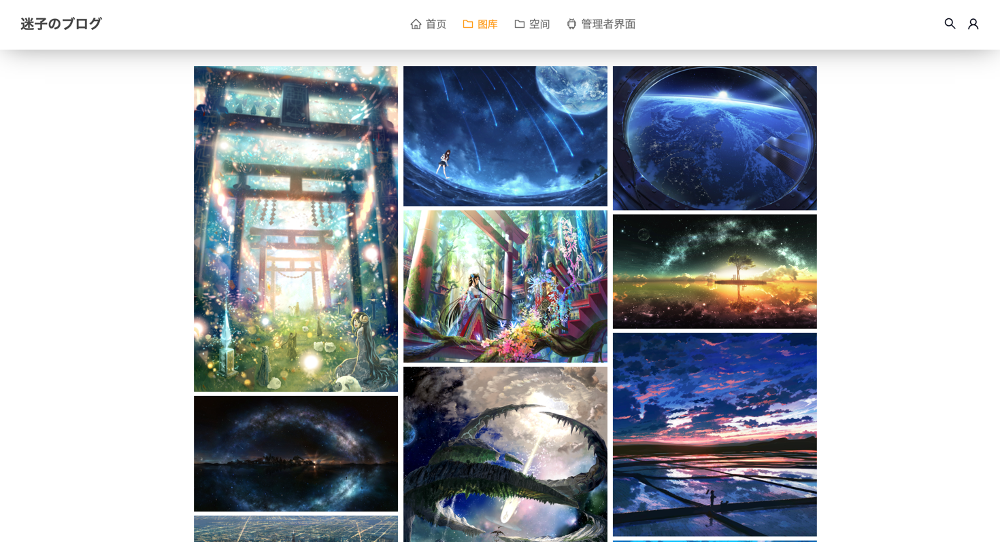
   使用react-masonry-css实现瀑布图，点击图像可进入图像详情页。
   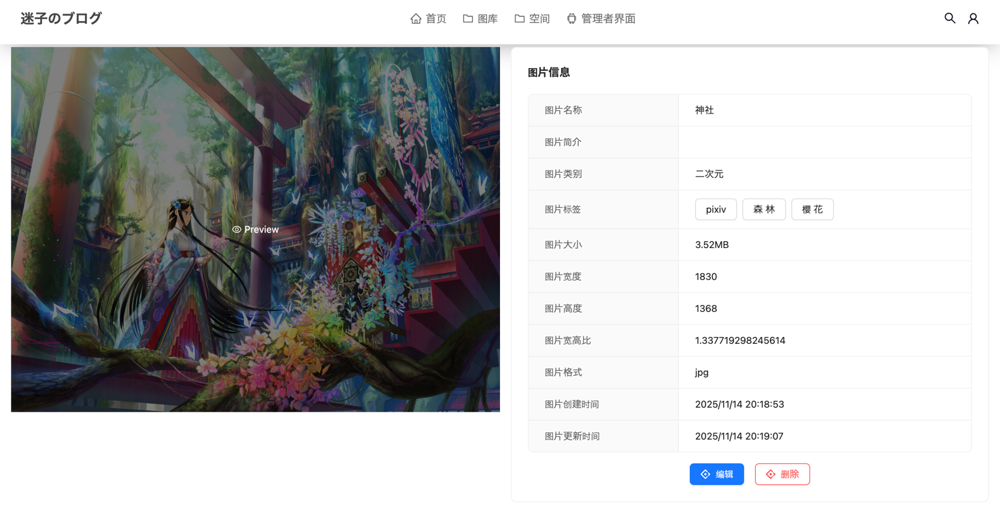
4. 空间页

   这部分比较复杂，涉及到多个页面。首先是空间页的首页。
   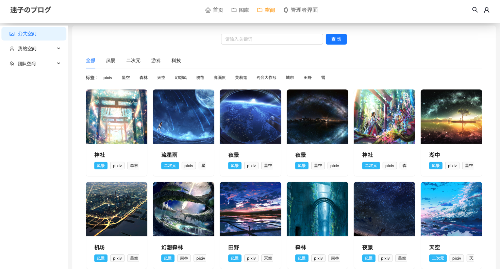
   然后是私有空间：
   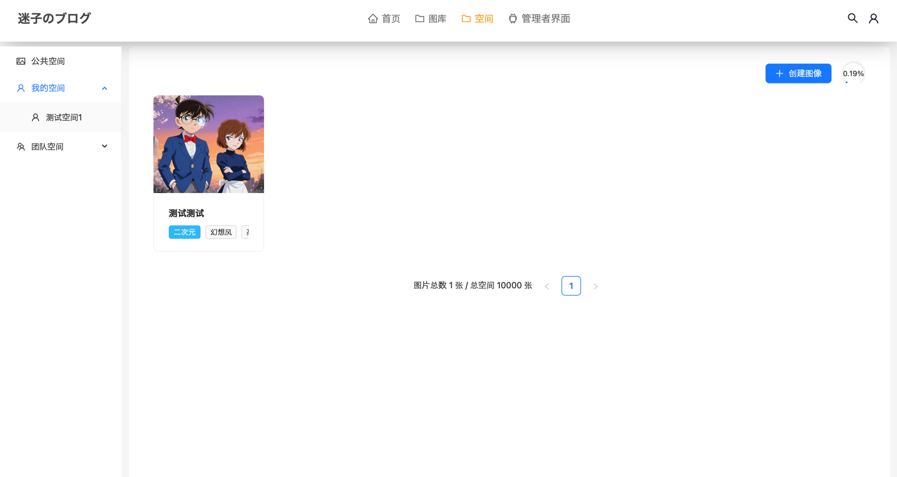
   接下来是团队空间：
   
   在团队空间中，涉及到团队空间管理:
   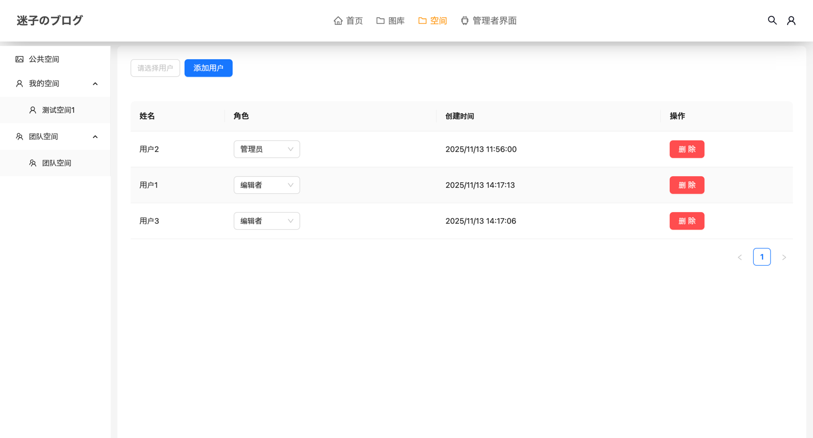
   也可以发表和编辑图像：
   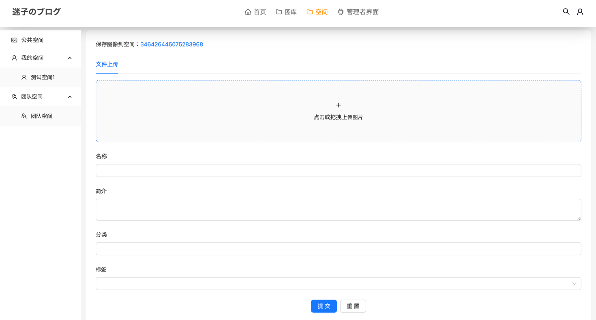
   在团队空间上，还可以协同编辑图像。
   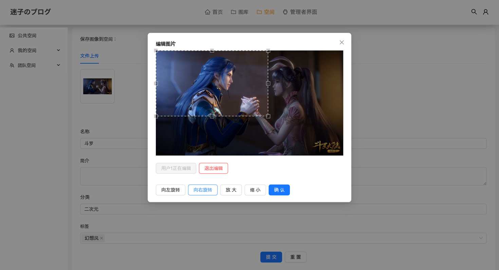
   不过这个协同编辑图像目前只能从扩大缩小左旋和右旋四个操作才能协同编辑，未来会改善这一点的。

### 后台

1. 登录
   
   使用Shadcn/ui和React实现。图源来自于某一个随机图片源。
2. 首页
   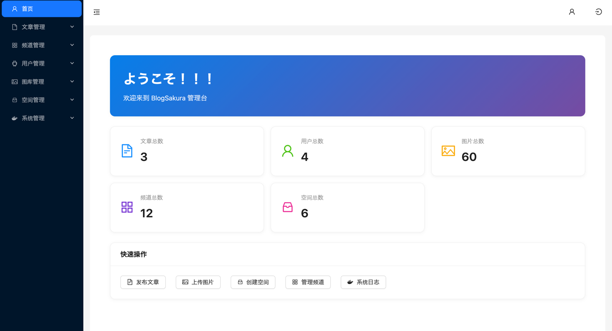
   首页和其他界面都是使用React和Ant Design实现。
3. 文章管理
   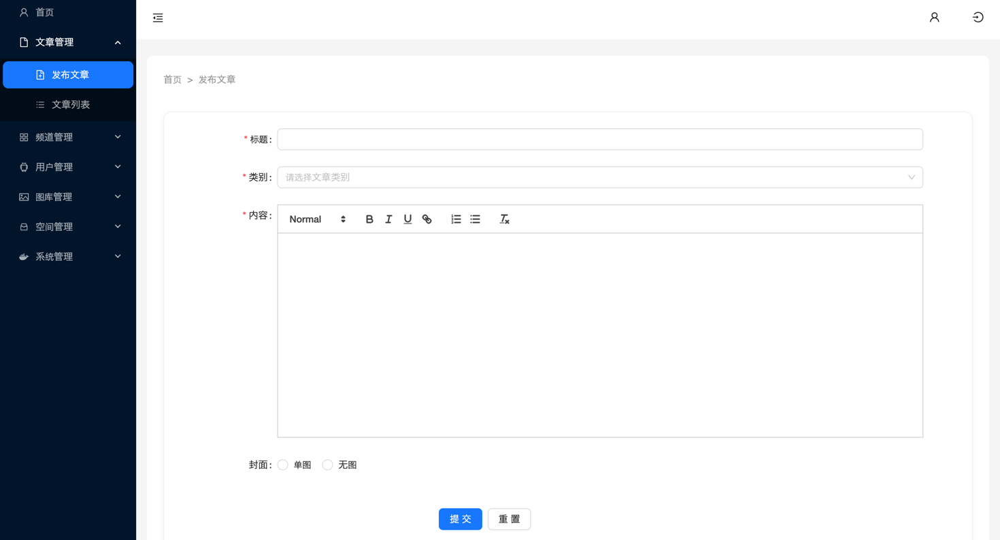
   发表文章。
   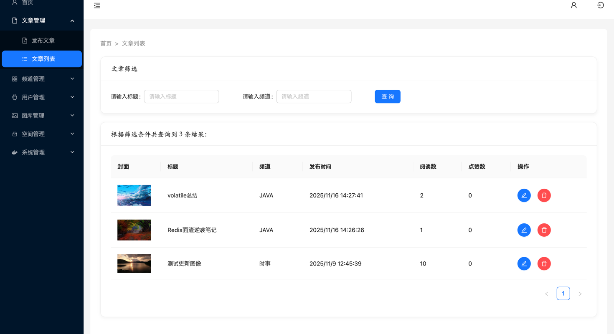
   管理文章，其中可以从标题和频道进行双维度搜索。
4. 频道管理
   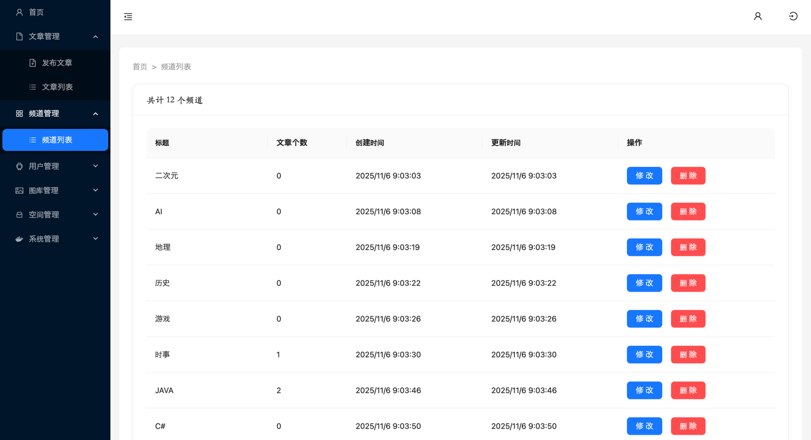
   管理频道。
5. 用户管理
   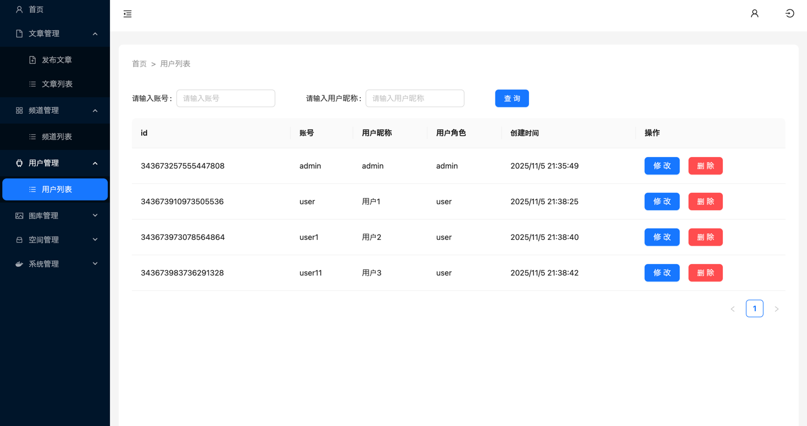
   管理用户。
6. 图库管理
   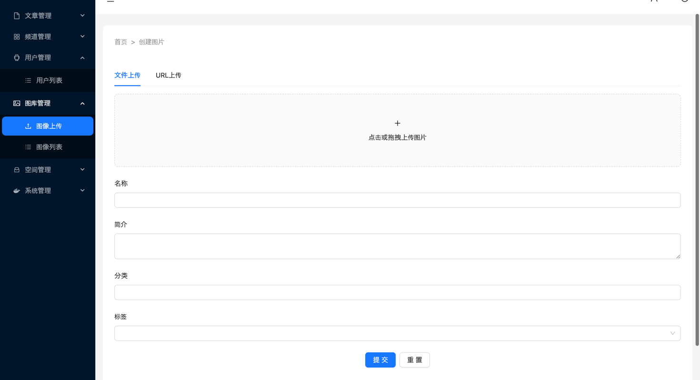
   可以上传图像，有本地上传和URL上传。
   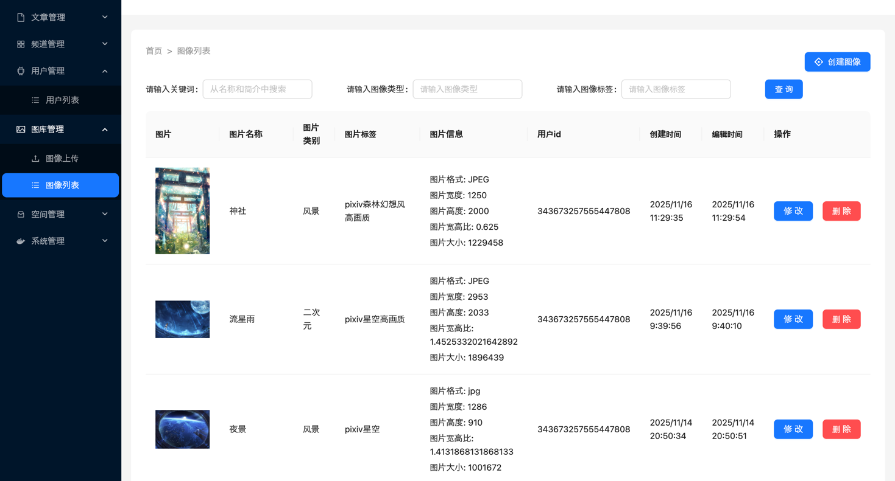
   管理图像。
7. 空间管理
   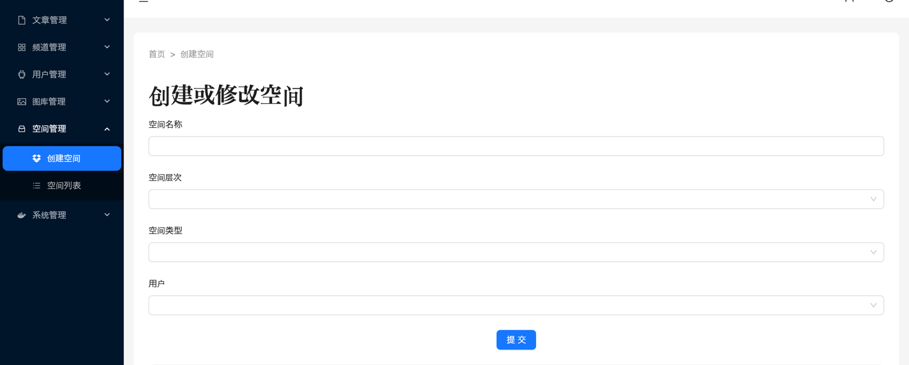
   此处用户管理员创建和编辑空间。
   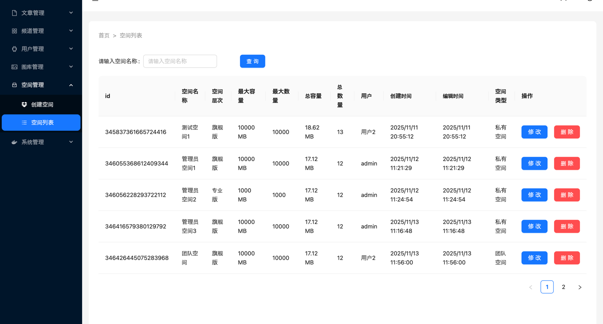
   管理员管理空间。
